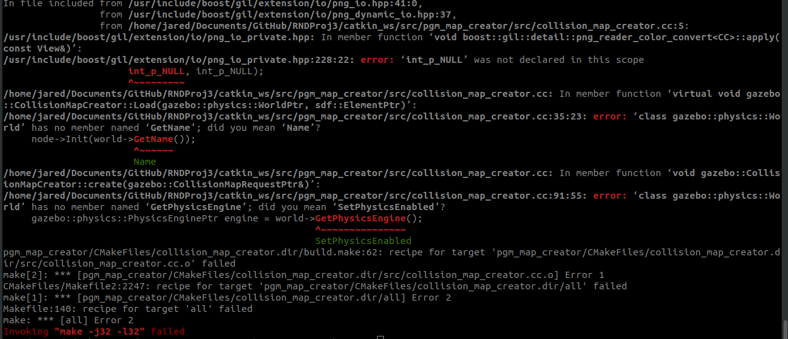

# RNDProj3
This repository contains previous code used in the "Go Chase It!" project and will finish the "Where Am I?" project. The labs will also be contained in the root folder above catkin_ws.

## -- To use this repository -- 
*   Have ROS Melodic Installed
*   Clone  or submodule add https://github.com/udacity/pgm_map_creator.git into the catkin_ws/src folder
*   Run catkin_make in the catkin_ws folder 
*   If compilation fails due to errors similar to the image below
 
    *   edit collision_map_creator.cc file
        *   Line 35: 
            *   from: `node->Init(world->GetName());`
            *   to: `node->Init(world->Name());`
        *   Line 91:
            *   from:
                ```c
                gazebo::physics::PhysicsEnginePtr engine = world->GetPhysicsEngine();
                ```
            *   to: 
                ```c
                gazebo::physics::PhysicsEnginePtr engine = world->Physics();
                ```
        * Insert new line below line 3:
            *   Add the two below lines
                ```c
                #define png_infopp_NULL (png_infopp)NULL
                #define int_p_NULL (int*)NULL
                ```

